<div align=center>
<p style="font-size:20px; line-height: 30px"> Analysis Report about Assignment 3 - Windy Gridworld with King's Moves Problem </p>
</div>

<div align="center" style="margin: 100px">
<p align="center" style="font-size:15px; margin:30px"> 1. Lei Xu</p>
<p align="center" style="font-size:15px"> 2. Peiqi Wang</p>
</div>

<div style="page-break-after: always"></div>

<div align=center>
<p style="font-size:15px; margin=20px"> Table of Content </p>
</div>

[toc]

<div style="page-break-after: always"></div>

## 1. Background

In the assignment 3, I will solve the **Windy Gridworld with King's Moves** problem (**Eight and Nine possible actions**) based on **ϵ−greedy SARSA** algorithm. And then I will present the final optimum solution and analyze the result.

## 2. Introduction

Before explaining the **ϵ−greedy SARSA Algorithm**, I will introduce **reinforcement learning** (RL) and **Temporal-Difference Learning** (TD Learning) first.

### 2.1 Reinforcement Learning

The attribute of the Windy Gridworld with King's Moves problem is, actions may affect not only the immediate reward but also the next situation and, through that, all subsequent rewards. These two characteristics, trial-and-error search and delayed reward are the two most important distinguishing features of reinforcement learning. That is why I will introduce the reinforcement learning in the assignment.

>**Reinforcement Learning** (RL) is a type of machine learning technique that enables an agent to learn in an interactive environment by trial and error using feedback from its own actions and experiences.

Beyond the agent and the environment, one  can identify eight main subelements of a reinforcement learning system:

1. $S_t$ : defines the status of the environment.
2. $A_t$ : defines the action of the agent.
3. $R_t$ : defines the goal of a reinforcement learning problem.
4. $policy$ : defines the learning agent's way of behaving at a given time. Roughly speaking, a policy is a mapping from perceived states of the environment to actions to be taken when in those states.

	The common policy expression is the conditional probability distribution - $\pi(a|s)$
	
	$\pi(a|s) = P(A_t = a| S_t =s)$
	
	At the status $s$, the probability of taking action $a$

5. $\nu_\pi(s)$ : defines the value when the agent is in policy $\pi$ and status $s$. Roughly speaking, the value of a state is the total amount of reward an agent can expect to accumulate over the future, starting from that state.

	$\nu_\pi(s) = E_{\pi}(R_{t+1} + \gamma R_{t+2} + \gamma^2 R_{t+3} + ...|S_t = s)$

6. $\gamma$ : is the discount-rate factor. Usually, it is between $0$ and $1$.
7. $P(s'|s, a)$ : defines the probability of transition to state $s'$, from state $s$ taking action $a$.
8. $\epsilon$ : defines the probability of taking a random action in an ϵ-greedy policy

### 2.2 Temporal-Difference Learning

If one had to identify one idea as central and novel to reinforcement learning, it would undoubtedly be temporal-difference (TD) learning.

>**Temporal difference (TD) learning** refers to a class of model-free reinforcement learning methods which learn by bootstrapping from the current estimate of the value function. These methods sample from the environment, like Monte Carlo methods, and perform updates based on current estimates, like dynamic programming methods.

TD methods only wait until the next time step to update the value estimates. At time t + 1 they immediately form a target and make a useful update using the observed reward Rt+1 and the estimate V (St+1). The simplest TD method makes the update:

$V(S_t) = V(S_t) + \alpha(R_{t+1} + \gamma V(S_{t+1}) - V(S_t))$

where:

1. $V(S_t)$ is the previous expected approximate state value at tie $t$.
2. $\alpha$, between $0$ and $1$, is a step-size parameter.
3. $R_{t+1}$ is the reward at time $t+1$,  typically due, stochastically, to $S_t$ and $A_t$
4. $\gamma$, between $0$ and $1$, is a reward discount rate
5. $\gamma V(S_{t+1})$ is the discounted value on the next step.

The action value expression is shown below:

$Q(S_t, A_t) = Q(S_t, A_t) + \alpha(R_{t+1} + \gamma Q(S_{t+1}, A_{t+1}) - Q(S_t, A_t))$

where:

1. $\alpha$, between $0$ and $1$, is a step-size parameter.
2. $\gamma$, between $0$ and $1$, is a reward discount rate.
3. $R_{t+1}$ is the reward at time $t+1$,  typically due, stochastically, to $S_t$ and $A_t$
4. $Q(S_t)$ is the expected approximate action value at time $t$.

<div align=center>
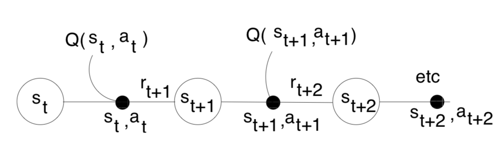
<p style="font-size:10px;font-color:#969696">Figure 2.1 Temporal-Difference Learning Principle </p>
</div>

### 2.3 ϵ−greedy SARSA Algorithm

**SARSA (State-Action-Reward-State-Action) algorithm**, is an **on-policy** algorithm which means that while learning the optimal policy it uses the current estimate of the optimal policy to generate the behaviour. SARSA converges to an optimal policy as long as all
state-action pairs are visited an infinite number of times and
the policy converges in the limit to the **greedy policy**.

To achieve the optimal result, I have to balance between the **exploitation** (make the best decision given current information) and the **exploration** (gather more information) during the whole learning process using **ε-greedy policy** by setting $ε = \frac{1} {t}$

>**ε-Greedy** policy known as **Epsilon-Greedy** policy, is a way of selecting random actions with uniform distribution from a set of available actions.

Using this policy either we can select random action with $\epsilon$ probability and we can select an action with $1- \epsilon$ probability that gives maximum reward in given state. For example, if an experiment is about to run 10 times. This policy selects random actions in twice if the value of $\epsilon$ is 0.2.

Its formula shown below:

$argmax_aQ(a)$(with probability $1 - \epsilon$)
or random action (with probability $\epsilon$)
 

Here is the workflow of the ϵ−greedy SARSA algorithm:

<div align=center>
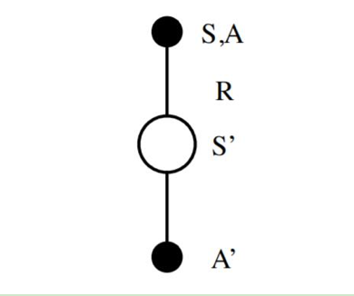
<p style="font-size:10px;font-color:#969696">Figure 2.1 Workflow of ϵ−greedy SARSA Algorithm </p>
</div>

Simplily speaking, the first step is to choose an action $A$ in the current state  $S$ based on ε-greedy policy. Then the environment will jump to a new state $S'$, meanwhile the agent will get an immediate reward. In the new state $S'$, a new action $A'$ will be chosen, which is used to update the tabular Q-function:

$Q(S_t, A_t) = Q(S_t, A_t) + \alpha(R_{t+1} + \gamma Q(S_{t+1}, A_{t+1}) - Q(S_t, A_t))$

This update is done after every transition from a nonterminal state $S_t$. If $S_{t+1}$ is terminal, then $Q(S_{t+1},A_{t+1}$) is defined as zero. This rule uses every element of the quintuple of events, ($S_t$, $A_t$, $R_{t+1}$, $S_{t+1}$, $A_{t+1}$), that make up a transition from one state–action pair to the next. This quintuple gives rise to the name Sarsa for the algorithm.

The pseudocode of the ϵ−greedy SARSA algorithm is shown blow:

```
Initialise Q(s,a), ∀s∈S, a∈A(s) arbitrarily, Q(terminal,·) = 0 
repeat (for each episode):
	Initialize S
	Choose A from S using ϵ−greedy policy derived from Q 
	repeat (for each step of episode):
		Take action A, observe R, S′
		Choose A' from S' using ϵ−greedy policy derived from Q 
		Q(S, A) ← Q(A, A) + α (r + γQ(S′, A′) − Q(S, A)) 
		S ← S′,A ← A′
	until S is terminal 
until convergence
```

## 3. Design & Implementation

In a mathematical, the Windy Gridworld with King's Moves problem can be modelled below:

1. The environment is a **7 X 10 table**
2. The start S is seen as a cell of the table described above
3. The goal G is seen as a cell different from the start S in the table described above.
4. Actions are **UP-LEFT, UP, UP-RIGHT, LEFT, RIGHT, DOWN-LEFT, DOWN, DOWN-RIGHT and STILL**
5. The wind is treated as values on each column of the table and the strength can be set as different numbers.

Then the question is how to find a optimum way to get to the cell G from the cell S in the table, considering values of each column.

<div align=center>
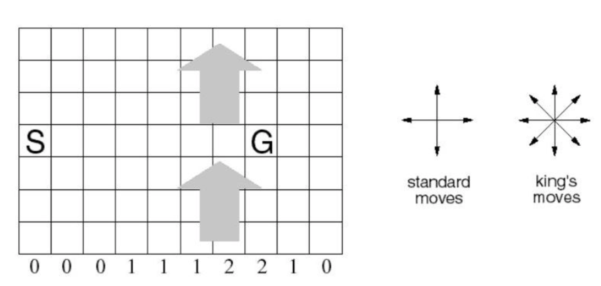
<p style="font-size:10px;font-color:#969696">Figure 3.1 Model of Windy Gridworld with King's Moves </p>
</div>

### 3.1 Design Based on ϵ−greedy SARSA Algorithm

According to the mathematical model of the Windy Gridworld with King's Moves, I will:

1. Parameterize each attribute of the model by creating a Sarsa class and initialize its parameters
2. Create a gridworld function to initialize the simulator environment
3. Create a Q table to store all values of actions and update it during learning
4. Choose an action using ε-greedy policy
5. Iterate each episode to find the optimal solution, which is the reinforcement learning process using ϵ−greedy SARSA Algorithm

### 3.2 Implementation

#### 3.2.1 Define Default Values

For the wind, starting point and goal, I use **list** to represent them.

1. **Wind**: values in the list represent its strength. $0$ means no wind.
2. **Start** and **Goal**: the first value in the list represents their row position and the second represent column position

For actions, here I use **dictionary** to   represent it.

1. The key is int value, representing which action it is. For example, 1 means left
2. The value is a tuple, representing its direction in row and column. For example, left can be set as (0, -1).

```python
# Wind strength for each column
WIND = [0, 0, 0, 1, 1, 1, 2, 2, 1, 0]
# Reward for each step
REWARD = -1
START = [3, 0]
GOAL = [3, 7]
class Sarsa(object):
	"""docstring for SARSA"""
	def __init__(self, alpha, gamma, epsilon, actions_number, world_height, world_width, episode_number):
		self.__alpha = alpha
		self.__gamma = gamma
		self.__epsilon = epsilon
		self.__actions_number = actions_number
		self.__world_height = world_height
		self.__world_width = world_width
		self.__episode_number = episode_number
		if self.__actions_number == 8:
			# ACTIONS = [ACTION_LEFT, ACTION_UP, ACTION_RIGHT, ACTION_DOWN, ACTION_UP_left, ACTION_UP_RIGHT, ACTION_DOWN_RIGHT, ACTION_DOWN_LEFT]
			self.__action_values = {1: (0, -1), 2: (-1, 0), 3: (0, 1), 4: (1, 0),
					 	 5: (-1, -1), 6: (-1, 1), 7: (1, 1), 8: (1, -1)}
		elif self.__actions_number == 9:
			# ACTIONS = [ACTION_LEFT, ACTION_UP, ACTION_RIGHT, ACTION_DOWN, ACTION_UP_left, ACTION_UP_RIGHT, ACTION_DOWN_RIGHT, ACTION_DOWN_LEFT, ACTION_STILL]
			self.__action_values = {1: (0, -1), 2: (-1, 0), 3: (0, 1), 4: (1, 0),
					 	 5: (-1, -1), 6: (-1, 1), 7: (1, 1), 8: (1, -1), 9: (0, 0)}
		else:
			# ACTIONS = [ACTION_LEFT, ACTION_UP, ACTION_RIGHT, ACTION_DOWN]
			self.__action_values = {1: (0, -1), 2: (-1, 0), 3: (0, 1), 4: (1, 0)}
```

#### 3.2.2 Define Gridworld Model

In fact, the gridworld can be treated as a two dimension list.

```python
def build_world(self):
	empty_gridworld = [[0 for j in range(self.__world_width)] for i in range(self.__world_height)]
	return empty_gridworld
```

#### 3.2.3 Initialize Q Table

For the Q table, here I also use **dictionary** to represent it.

1. The key is a tuple, storing the state and action. And the state is divided from horizontal direction and  vertical direction. It looks like (i, j, a).
2. The value is int value, representing action value .

```python
def init_q_table(self):
	q_table = {} # key: (s,a), value: value | (s = i,j)
	for a in range(1, self.__actions_number+1):
		for i in range(self.__world_height):
			for j in range(self.__world_width):
				q_table[(i, j, a)] = 0
	return q_table
```

#### 3.2.4 Define Best Action Function

Best action function is used to select the best action, which will be the one of options for the next step decided by $\epsilon$-greedy policy.

```python
def find_best_action(self, i, j, q_table):
	candidates = [0] * self.__actions_number
	for k, (ai, aj) in self.__action_values.items():
		out = (i, j, k)
		candidates[k-1] = q_table[out]
	index_opt = np.argmax(candidates)
	value = candidates[index_opt]
	index_opt += 1
	a_i, a_j = self.__action_values[index_opt]
	i_next = max(min(i+a_i, self.__world_height-1), 0)
	j_next = max(min(j+a_j, self.__world_width-1), 0)
	return value, index_opt, (i_next, j_next)
```

#### 3.2.5 Define Action Choice Function

This function is mainly responsible for the selection of the next action using $\epsilon$-greedy policy discussed above.

```python
def choose_action(self, i, j, q_table):
	cdf = [0] * (self.__actions_number+1)
	_, index_opt, candidate_position = self.find_best_action(i, j, q_table)
	for index in range(1, self.__actions_number+1):
		if index == index_opt:
			cdf[index] = cdf[index - 1] + self.__epsilon * 1.0 / self.__actions_number + 1 - self.__epsilon
		else:
			cdf[index] = cdf[index - 1] + self.__epsilon * 1.0 / self.__actions_number
	random_number = random.uniform(0, 1)
	next_action = bisect.bisect_left(cdf, random_number)
	return next_action, candidate_position
```

#### 3.2.6 Implement SARSA Algorithm

The SARSA function is the most important part of the program, which is to keep learning under the limit of episodes to find the optimum solution.

```python
def sarsa(self):
	state_values = self.build_world()
	q_table = self.init_q_table()
	g_i, g_j = GOAL
	for episode in range(self.__episode_number):
		optimal_actions = self.build_world()
		i, j = START
		a, candidate_position = self.choose_action(i, j, q_table)
		while i != g_i or j != g_j:
			optimal_actions[i][j] = a
			a_i, a_j = candidate_position
			a_i = max(0, a_i - WIND[a_j])
			a_next, candidate_position = self.choose_action(a_i, a_j, q_table)
			value = q_table[(i, j, a)]
			q_table[(i, j, a)] = value + self.__alpha * (REWARD + self.__gamma * q_table[(a_i, a_j, a_next)] - value)	
			i, j = a_i, a_j
			a = a_next
```

## 4. Result

As requested in the problem: 

1. **Learning Rate - alpha**: **0.5**.
2. **Discount Rate - gamma**: **0.9**.
3. **Greedy Rate - epsilon**: **0.1**
4. **Reward Value**: **-1**
5. **Start Position**: **[3, 0]**
6. **Goal Position**: **[3, 7]**
7. **Wind Strength**: **[0, 0, 0, 1, 1, 1, 2, 2, 1, 0]**

<div align=center>
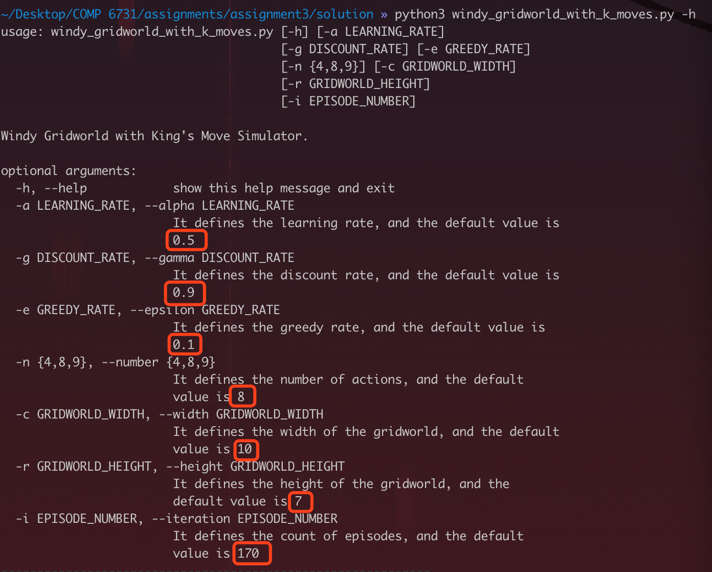
<p style="font-size:10px;font-color:#969696">Figure 4.1 Windy Gridworld with King's Moves Basic Settings </p>
</div>

### 4.1 Scenario 01 - **Eight Actions**

#### Case 01 - 8 Actions with 170 Episodes

***Purpose:***
	
Check whether the program can return the correct result.

***Requirements:***

1. **Basics:**:

	* Action Number: **8**
	* Episode Number: **170**

<div align=center>
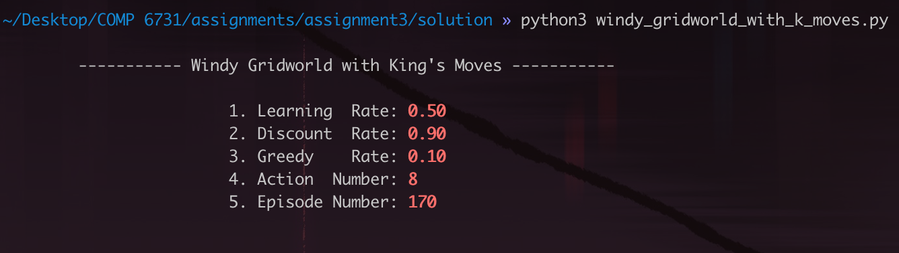
<p style="font-size:10px;font-color:#969696">Figure 4.2 Windy Gridworld with King's Moves Requirement </p>
</div>

<!--***Hypothesis & Analysis:***

<div align=center>
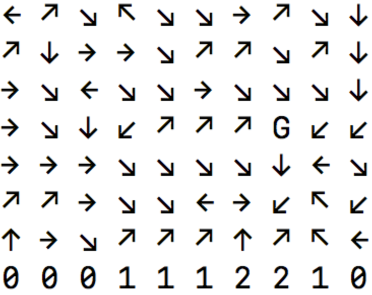
<p style="font-size:10px;font-color:#969696">Figure 4.3 Hypothesis with Eight Actions</p>
</div>-->

***Results:***

<div align=center>
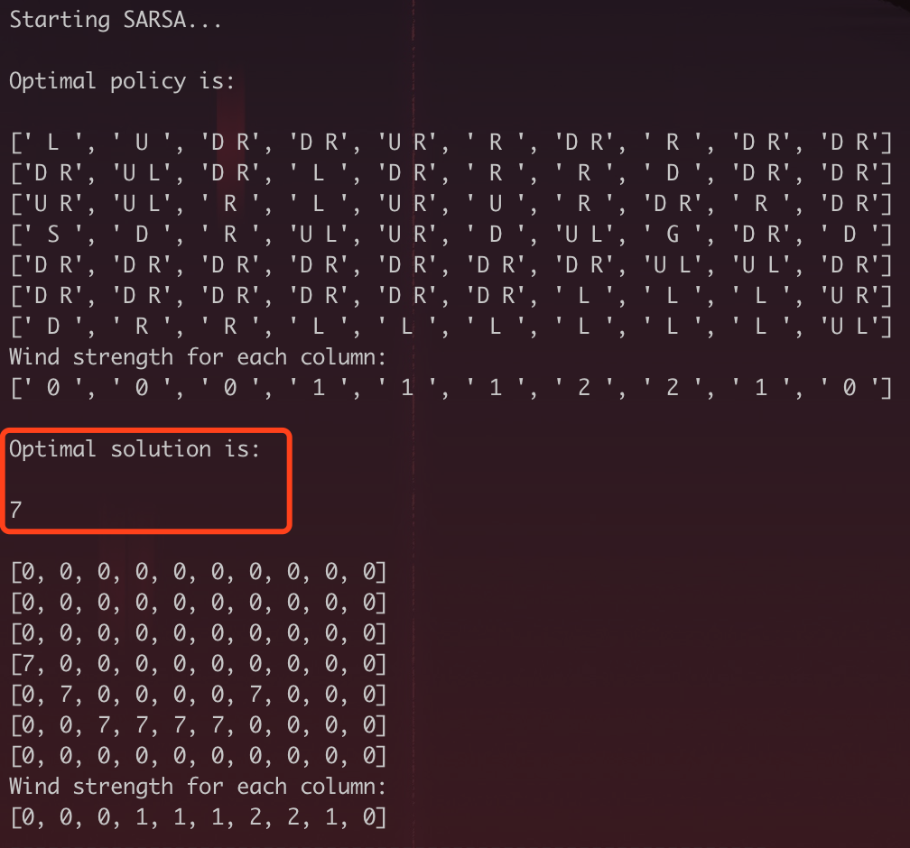
<p style="font-size:10px;font-color:#969696">Figure 4.3 Scenario 01 - Case 01 - Optimal Solution</p>
</div>

<div align=center>

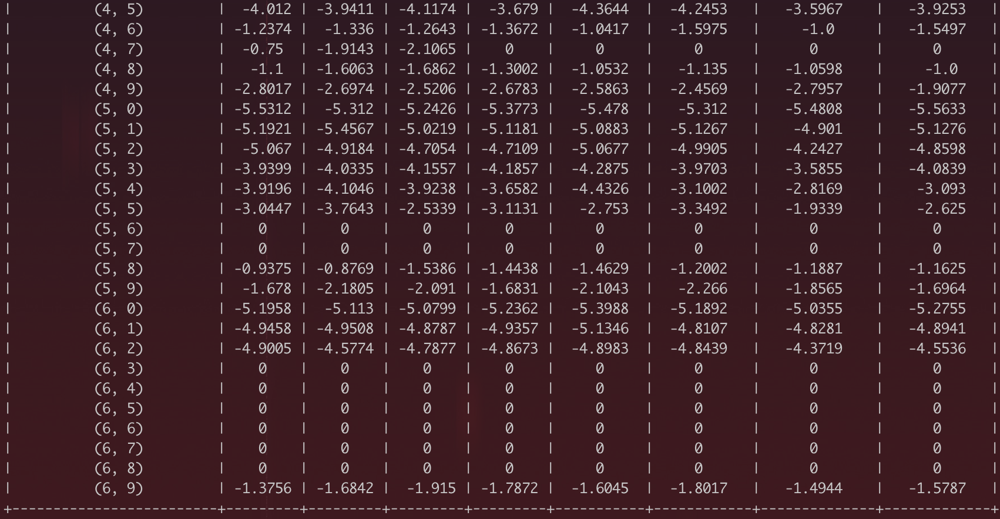
<p style="font-size:10px;font-color:#969696">Figure 4.4 Scenario 01 - Case 01 - Final Q Table</p>
</div>

### 4.2 Scenario 02 - **Nine Actions**

#### Case 01 - 9 Actions with 170 Episodes

***Purpose:***
	
Check whether the program can return the correct result.

***Requirements:***

1. **Basics:**:

	* Action Number: **9**
	* Episode Number: **170**

<div align=center>
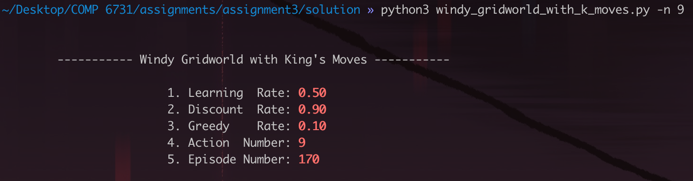
<p style="font-size:10px;font-color:#969696">Figure 4.5 Windy Gridworld with King's Moves Requirement </p>
</div>

<!--***Hypothesis & Analysis:***

<div align=center>

<p style="font-size:10px;font-color:#969696">Figure 4.6 Hypothesis with Nine Actions</p>
</div>-->

***Results:***

<div align=center>
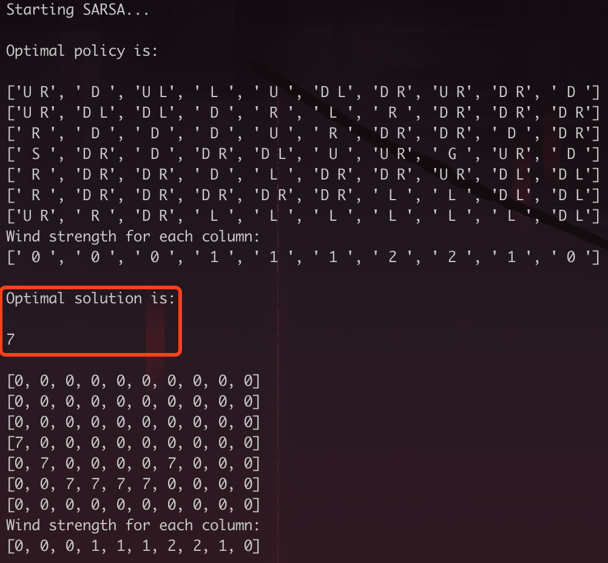
<p style="font-size:10px;font-color:#969696">Figure 4.6 Scenario 02 - Case 01 - Optimal Solution</p>
</div>

<div align=center>
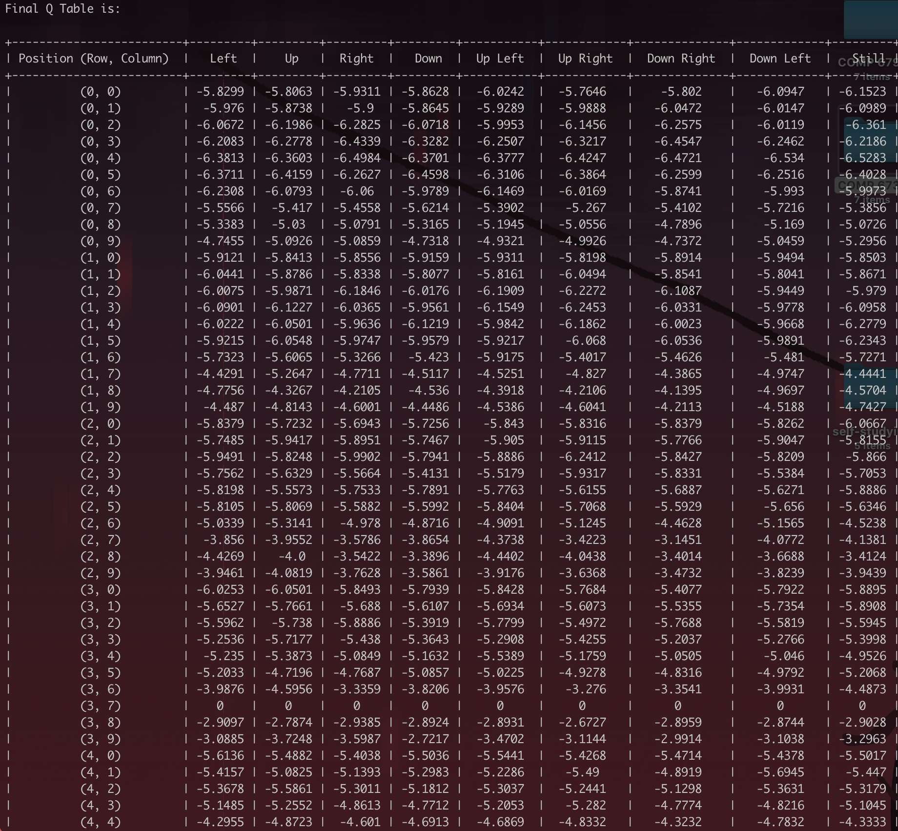
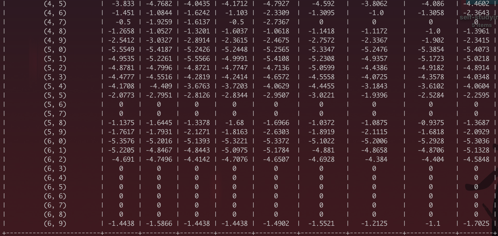
<p style="font-size:10px;font-color:#969696">Figure 4.7 Scenario 02 - Case 01 - Final Q Table</p>
</div>

## 5. Conclusion

According to the discussion and experiment above, I  can conclude that the SARSA algorithm is an On-Policy algorithm for TD-Learning, which means:

1. SARSA learns a near-optimal policy while exploring. If you want to learn an optimal policy using SARSA, then you will need to decide on a strategy to decay $\epsilon$ in $\epsilon$-greedy action choice, which may become a fiddly hyperparameter to tune.
2. SARSA will approach convergence allowing for possible penalties from exploratory moves, which makes SARSA more conservative - if there is risk of a large negative reward close to the optimal path.

In practice the last point can make a big importance if mistakes are costly - e.g. you are training a robot not in simulation, but in the real world. You may prefer a more conservative learning algorithm that avoids high risk, if there was real time and money at stake if the robot was damaged. Also, if your agent learns online, and you care about rewards gained whilst learning, then SARSA may be a better choice.